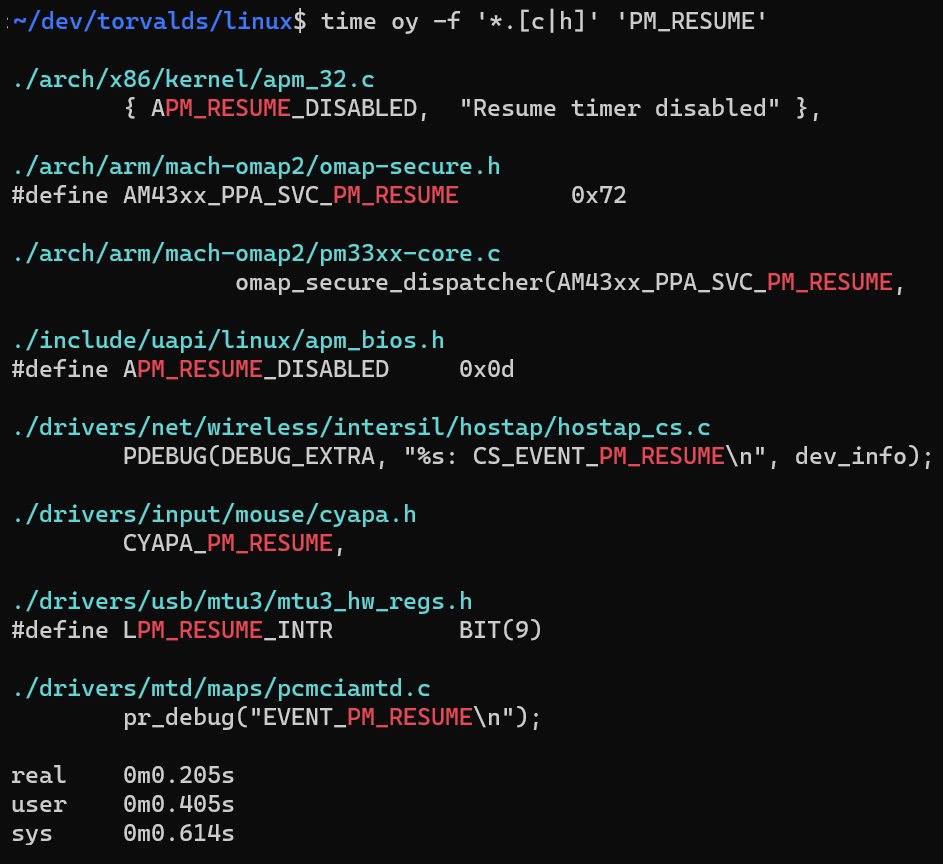

# oystr

`oystr` is a command-line tool that recursively searches directories for a substring.

<p align="center">
    
</p>

## Quick Start

Build `oystr` using CMake. For more details, see [BUILDING.md](https://github.com/p-ranav/oystr/blob/master/BUILDING.md).

```bash
git clone https://github.com/p-ranav/oystr
cd oystr

# Build
cmake -S . -B build -D CMAKE_BUILD_TYPE=Release
cmake --build build

# Install
sudo cmake --install build
```
